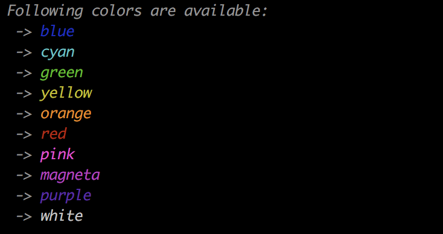
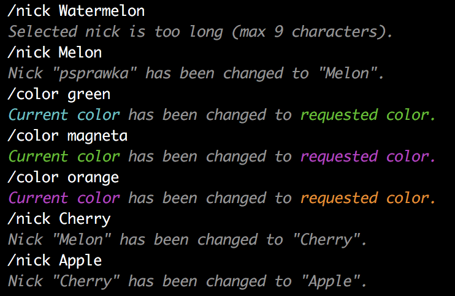

# IRC (42 Underground Chat) 🙊🙉

Using **circular buffor**, **TPC/IP network**, **select()** function for sockets management **~~and tempcaps~~**_(implementation soon)_ I created my own spy-free and money-free messanging system allowing multiple clients to connect (simultaneous) and chat within channels or/and private conversations. Everyone is able to to send and receive messages, as well as join/leave/create channels. In addition, each new user is greeted with a server-sent message introducing features that user can utilize whenever adn wherever within a program:


</br>

## 42 Underground Chat

<p float="left">
  
  
  
  
</p>
</br>

## Run 42 Underground Chat
```
git clone https://github.com/psprawka/IRC.git IRC-psprawka
cd IRC-psprawka
make 
```
1. In first terminal run following command:
```./server <port>``` i.e. ```./server 8888```.
2. In second window run a client with a port matching server port and server's machine adderss:
```./client <port> <address>``` thus if you run your client on localhost ```./client 8888 0.0.0.0```.
</br>
You're connected to the server! 😁
</br>
Add more clients repeating step 2 and enjoy spy-free 42 Underground Chat 😎😎😎
